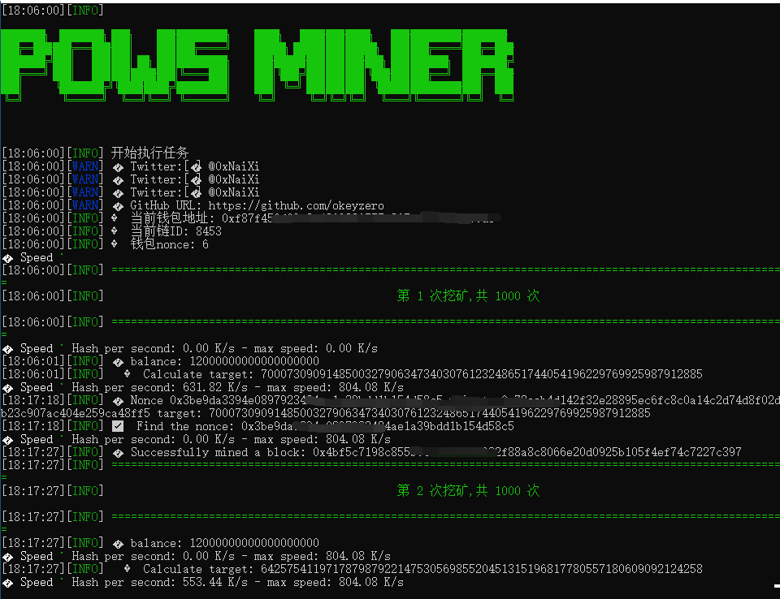

# egg_miner_rs rust 版本 
# 网站
https://eggfarm.org/
# 软件截图

# 使用方法
1,下载本项目,自行编译或者运行别人编译好的版本
```
# 如果安装过rust 可以输入命令(务必设置好.env文件内容)
cargo run --release
```
2,自行设置.env文件内容

3,运行
1. 打开软件目录控制台
2. 输入软件名字 回车即可

# 提示
1. 当前没实时获取难度，所以可能又发送交易但是失败的情况。无视即可，因为gas低无所谓，加上实时会降低性能

# 说明
1. 只是学习rust的练手项目(代码搬运工)，代码比较烂，有更优者可以留言你的项目地址
